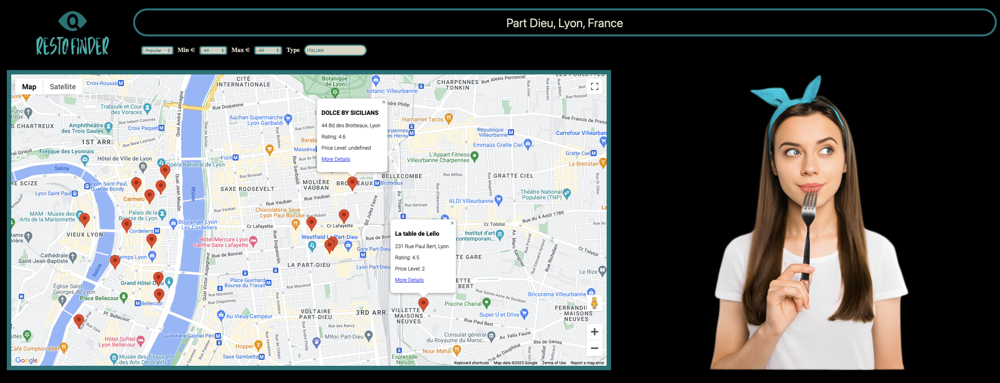
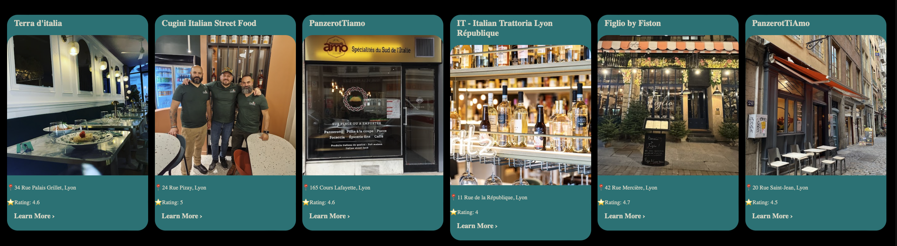
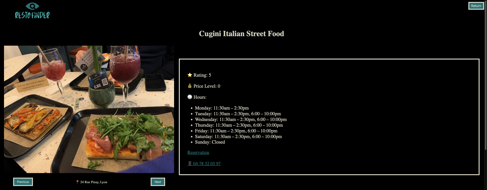
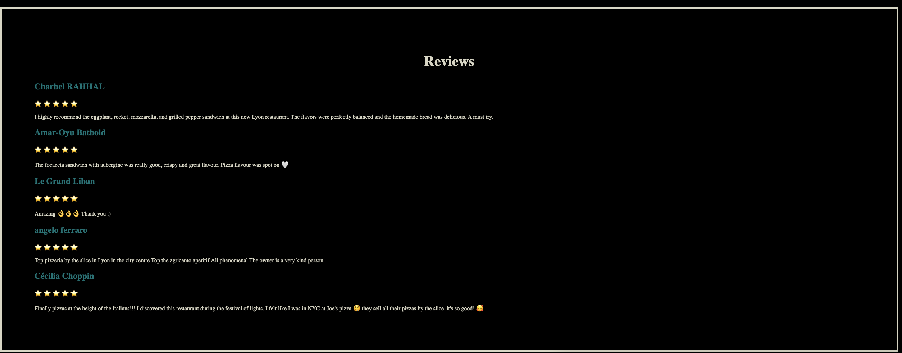

# RestaurantSearchEngine

## Production server

Hosted with Netify on https://restofinders.com/

## Development server

Run `npm install`

Run `ng serve` for a dev server. Navigate to `http://localhost:4200/`. The application will automatically reload if you change any of the source files.

## Build

Run `ng build` to build the project. The build artifacts will be stored in the `dist/` directory.

## Instructions

1. Enter the location and click on one of the autocomplete searches; otherwise, it will not work.
2. Apply the filters you want.

## ⚠️ Warning

This project was generated with [Angular CLI](https://github.com/angular/angular-cli) version 16.1.0.

## Preview

